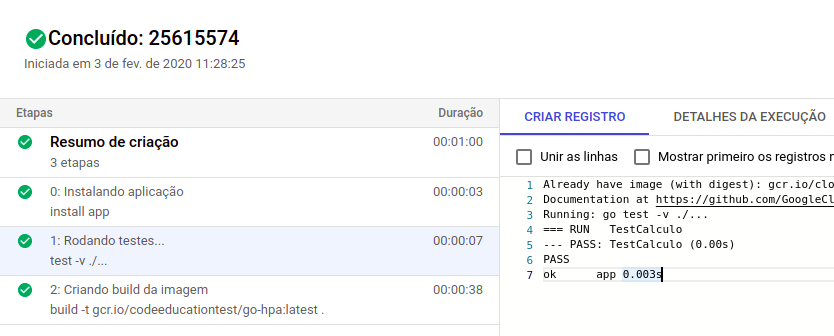
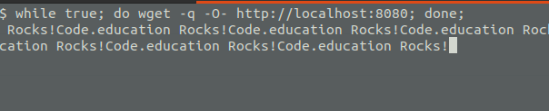

# Code Education - desafio 6 - Kubernetes e hpa

### 1) Implementar algoritimo em Go Lang (looping somando a raiz quadrada):

+ Nome do deployment, service e nome da imagem deverá se chamar: go-hpa
+ Testes
+ Processo de CI
+ Push da imagem no Docker Hub (seu-user/go-hpa)
+ Deploy da imagem no K8S (arquivos de deployment e services)
+ Cada réplica deverá consumir no mínimo 50m e no máximo 100m.

### 2) O "hpa" do deployment tem as seguintes características:

+ O processo de escala inicia quando a CPU passar de 15%
+ Quantidade mínima de pods: 1
+ Quantidade máxima de pods: 6

### 3) Fazer teste usando requisições através de um looping e analisar o autoscaler.

**Entrega**:

**3.1 - Execuçcão da build:**



**3.2 - Execuçcão dos recursos:**

```sh
kubectl apply -f deployment.yaml

kubectl apply -f service.yaml

kubectl apply -f hpa.yaml
```
**3.3 - Teste do HPA:**

Primeiro fazer um Port Forward: 

```sh
kubectl --namespace default port-forward <NOME_DO_POD> 8080:80
```

Em seguida executar o comando:

```sh
while true; do wget -q -O- http://localhost:8080; done;
```



Abrir outro terminal e executar o comando:
```sh
watch -c kubectl get all -n default
```

E observar o deployment **deployment.apps/go-hpa-server** 

```sh
NAME                            READY   UP-TO-DATE   AVAILABLE   AGE
deployment.apps/go-hpa-server   6/6     6            6           17m
```
